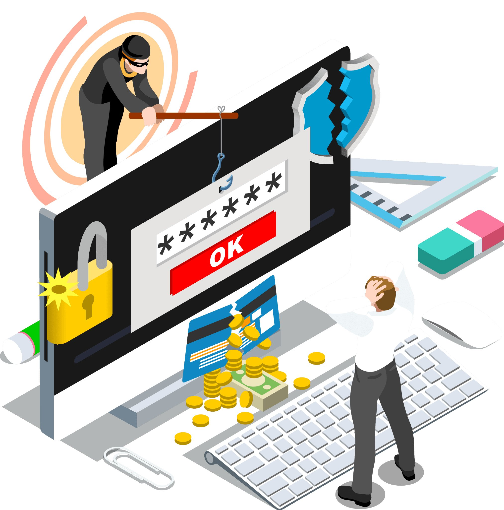

# Phishing Script

**Disclaimer: This phishing script is created and provided solely for educational purposes to enhance understanding of
ethical hacking techniques. Use this script responsibly and legally, with explicit permission from the target for any
testing or demonstration purposes. The creator and maintainer of this script are not liable for any misuse or illegal
activities conducted with it.**

# Introduction

This repository contains a phishing script that has been developed using HTML and PHP. The purpose of this script is to
facilitate learning in ethical hacking by demonstrating how phishing attacks work and the techniques employed to trick
unsuspecting users.

Please note that this script should only be used in controlled environments where proper authorization has been
obtained. Using this script for illegal purposes or without appropriate consent is strictly prohibited.

## Features

- Simple and straightforward HTML and PHP implementation
- Mimics the appearance and behavior of a legitimate login page
- Collects user credentials for educational analysis and awareness

## Usage

1. Clone or download the repository to your local machine.
<pre><code>git clone https://github.com/cyberhappy/Phishing-Script.git
</code></pre>
2. Set up a web server environment like Apache or Nginx on your local machine or use an online hosting service that
   supports PHP In my case, I am using PHP on my local machine.
3. Place the contents of the repository into the document root directory of your web server.
4. Customize the script by modifying the HTML and PHP files to match your desired target website (for educational
   purposes only).
5. Start the web server and ensure that it is running correctly.
<pre><code>php -S $YourIP:80
</code></pre>
6. Access the phishing script through the assigned URL or IP address.
7. Share the phishing URL with participants who have explicitly agreed to participate in the educational exercise.
8. Monitor the collected data for educational analysis and awareness purposes.
9. Destroy all collected data after the analysis and exercise to maintain privacy and security.

## Disclaimer

The creator and contributors of this phishing script shall not be held responsible for any misuse, illegal activities,
or damages caused by the misuse of this script. It is essential to use this script responsibly and ethically, adhering
to all applicable laws and regulations.

Please ensure that you have appropriate authorization and consent from all involved parties before using this script
for any purpose.

## Conclusion

The phishing script provided in this repository is a tool for educational purposes only. It aims to enhance
understanding of ethical hacking techniques and raise awareness about phishing attacks. Remember to use this script
responsibly and legally, always respecting the privacy and rights of others.

Happy learning and stay ethical!
